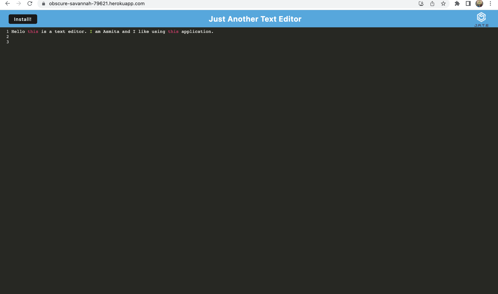

# Text Editor PWA

## Table Of Contents

[Description](#description)

[Usuage Information](#usuage-information)

[Questions](#questions)

[License](#license)

[Screenshots](#screenshots)

## Description

This is a text editor application which will allow you to take notes. It can run with or without internet connection and can be downloaded as a PWA.

## Usuage Information

Run `npm i` to install all packages for both client and server. Run `npm run start` to start the application. You can visit application on `localhost:3000`.

## License

Licensed under the [MIT](https://choosealicense.com/licenses/mit) license

## Questions

[Github repo](https://github.com/devAsmi)

## Screenshots

